## 为何用 1Password ？

我之前是用自己的服务器加开源的 [Vaultwarden](https://github.com/dani-garcia/vaultwarden) 项目来配合 Bitwarden 插件使用的。Bitwarden 同样很强大很好用，而且也支持我这篇文件所提到的 SSH 验证接管等功能。

而且我去年在 1Password 赠送新用户一年家庭版权益的时候也用过 1Password，不过嫌它国内访问慢，就转而采用自建的方案了，一直用到 2025-07-13。

就在前两天，我看到 1Password 又开启了新的赠送活动，于是我拿自己的主邮箱去注册了一个拿来用用。也许是因为许久没用了，我倒是觉得 1Password 的 UI 好像比之前好看了一些，然后国内访问效果好像没有以前那么让人难绷了。再加上 1Password 这么久了也没有出过什么问题，自己自建 Vaultwarden 还需要进行数据备份（其实也不麻烦，计划任务罢了，服务器也还有三年多才过期），想着干脆就用用 1Password 得了……

于是乎，我便将我的 Vaultwarden 密码数据导出，放到了 1Password 中（但是我的 Vaultwarden 数据还在，偶尔我也会将 1Password 里面的数据导入到我的 Vaultwarden 中，也算是一个后手吧），打算在这段时间内好好用用这个 1Password，让我感受一下来自 “大厂” 的体验。

## 关于密码管理器

当时我在我服务器上自己搭建好了 Vaultwarden 的服务之后，我也问过我周边的人，“你需不需要管理很多密码呀？”，想着让他们也可以感受到密码管理器给我们带来的便利 —— 什么只要记住一个主密码、密码自动填充、生物验证、二步验证、强密码生成、多端同步、自动保存……

但是转了一圈发现，好像没几个人用到，我得到的回答要么是“我的密码很少的”，或者是“我只用那么一两个密码的”，也有的是“我觉得没有必要……”。我也不好说些什么，毕竟确实，这种密码管理工具在日常生活中似乎没有什么存在感，大家只要保密好那几个关键的密码就好了，其他的也许通过 “微信登录” 或者 “手机号短信验证码登录” 就可以替代了，完全不需要考虑用密码管理器。

对我而言，从接触到一直使用密码管理器也是一个意外。那是我在翻看 1Panel 的应用商店的时候，看到了那个叫作 Bitwarden 的应用，然后我点击了查看详情，自此一发不可收拾……我将我原本保存在浏览器（其实这个很不安全，因为浏览器一般是明文保存密码的，也就是说只要有人能够操作你的电脑，那么就可以获得你浏览器中保存的所有用户名和对应的网站以及密码）、笔记本、手机备忘录中的密码全部都迁移到了 Bitwarden（其实就是 Vaultwarden）中去，开始了我的密码自动填充和管理之旅。

我只需要在浏览器上装好对应的同名插件，然后连接到我的自建服务器对应的域名，然后登录一下，就可以享受到它所带来的便利。而且如果你的电脑支持生物解锁（其实就是我们常说的“指纹解锁”或者“面容识别”），也可以一键关联，省去密码的输入步骤，快速填好需要的密码，而且还能同步和管理所有的二步验证码（这个功能在国内其实挺小众的，国外很常见，国内一般是面向开发者才有的，如果不知道这个是什么，可以类比银行的 U 盾，是一种基于时间的二步验证码），也可以同步管理一些私密的信息。

总之，我认为在现在信息化的社会，使用一个密码管理器也是很有必要的，不但可以让我们每次设置密码都无需思考（可以智能填充强密码并且一键保存），而且能够让我们避免因为想不出而大规模使用相同密码而产生的隐患。

## 1Password 配置 SSH 密钥

我们回到正题。

在之前我管理自己的 SSH 密钥的时候，我是采用一机一码的形式，这个时候就比较繁琐，因我有时候会重装系统，或者使用其他设备进行 SSH 验证，这个时候我只能重新生成和设置好一个新的 SSH 密钥然后将公钥绑定到我的账户里面去。

而在使用 1Password 等密码管理器后，我的私钥是存储在 1Password 中的，数据是存在云端而非本地，我只要在新设备或者我的其他设备上配置好 1Password，然后按照提示修改好配置文件，就可以无缝地在新设备上进行 SSH 验证等操作。

其实我们不难发现，比如 Termius 这样的软件，就是采用云端存储私钥的方式，来帮助我们用户在多设备的时候，可以无视设备的环境配置情况，只要下载安装好 Termius，登录同一个账户，数据就会同步，然后直接 SSH 连接即可。

1Password 也差不多，只是在一些机制上更为巧妙一些。

首先我们需要在本地有需要保存到 1Password 里去的私钥，如果没有可以先生成，然后通过 1Password 的「开发者」选项卡进入到这个单独的界面，补充一下，是桌面应用才有的功能，网页版不可以：

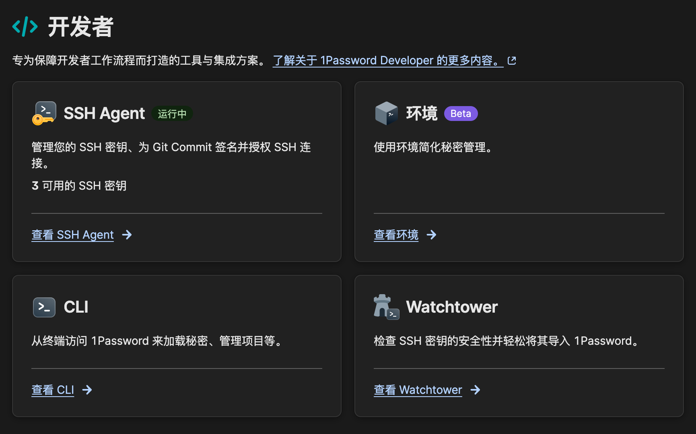

启用这个功能之后，如果你本地有密钥，那么可以点击右下角的「Watchtower」来一键扫描和导入。我已经完成了导入了，所以我们直接点击左上角的「SSH Agent」来查看一下我们当前已经保存好的密钥情况：

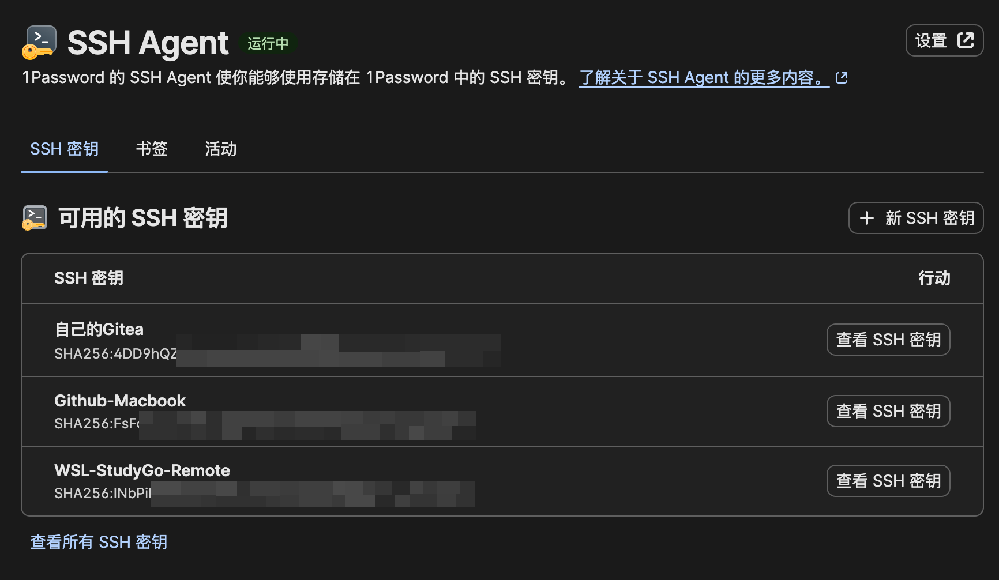

点击我们需要绑定到平台的密钥（假设还没有完成绑定），比如我需要将「GitHub-MacBook」这个密钥绑定到我的 GitHub 上去，那么就点击对应密钥的右侧的「查看 SSH 密钥」，然后在新窗口中，点击「公钥」部分复制，然后在对应的平台上面绑定好即可：

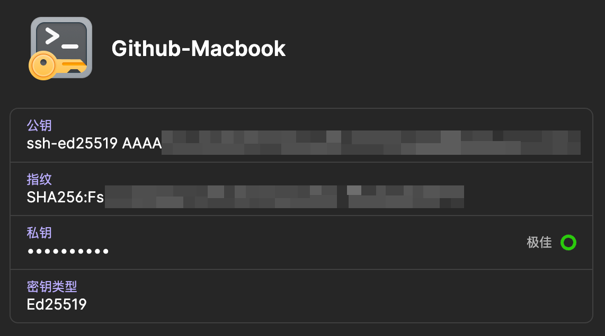

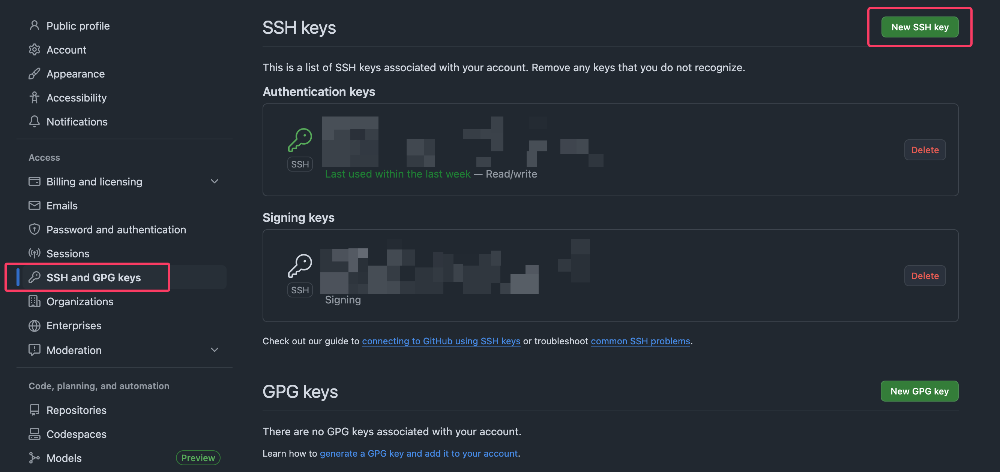

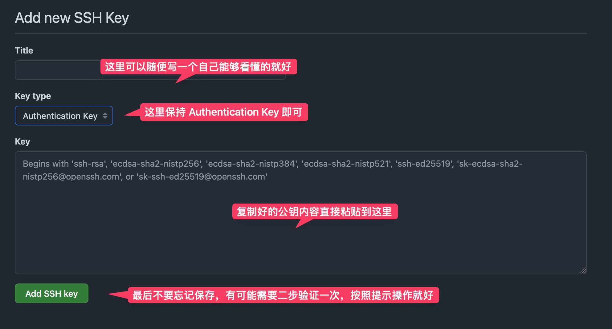

这里添加成功之后我们需要回到 1Password 中去，然后进入 1Password 的设置，启用「SSH Agent」这个功能，也就是框选出来的部分需要打上钩，如果是在这个设备上第一次设置，那么就会弹出提示，让你将一段配置文件添加到自己家目录下的 `.ssh` 目录下的 `config` 文件中去（也就是常说的 `~/.ssh/config` 文件），一般情况下可以选择「自动添加」，然后 1Password 就会自动将配置写入到正确位置，其他的配置则保持默认即可，当然你也可以使用我的配置：

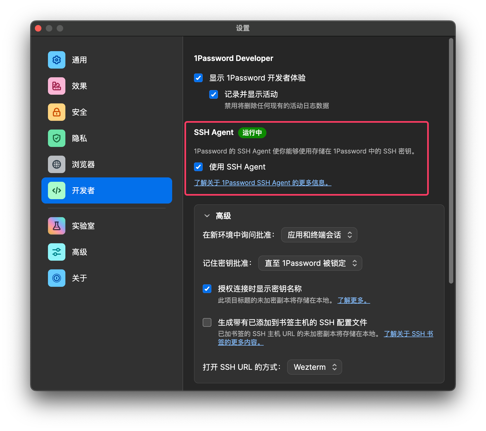

写入的内容类似这样：

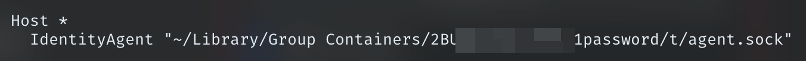

然后我们可以在终端中通过 `ssh -T git@github.com` 命令尝试连接一下 GitHub，如果不出意外的话，执行这个命令会出现一个类似下面的授权窗口：

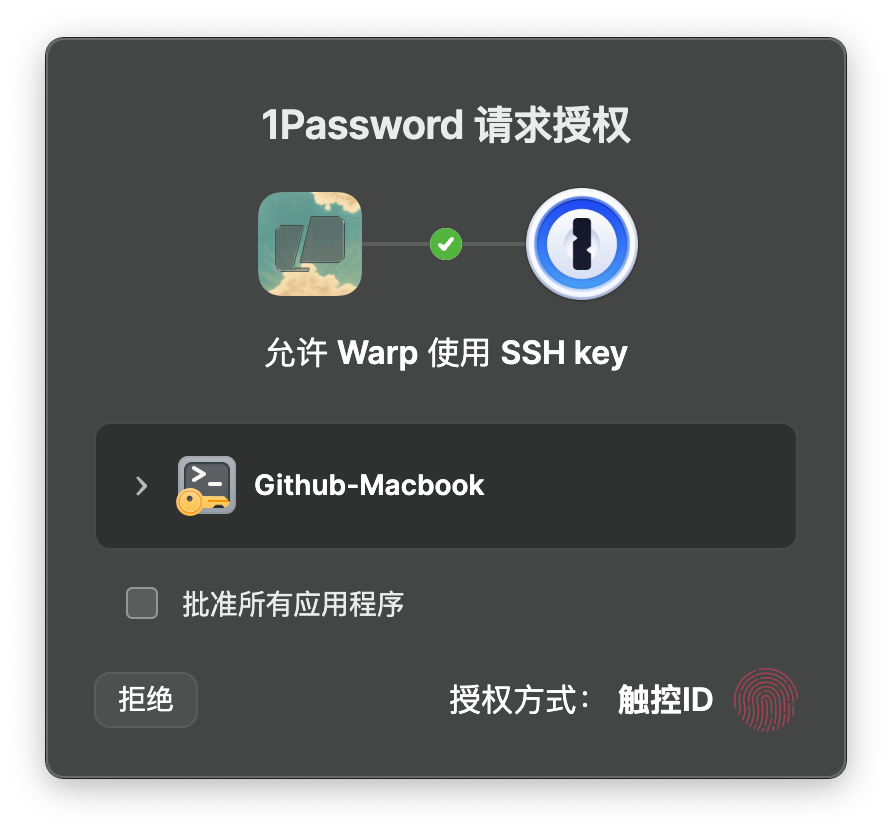

进行批准之后，就会显示连接成功的消息：

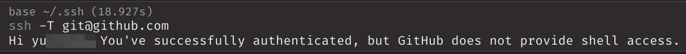

至此，我们便配置好了 1Password 的 SSH 连接管理。当你有多个需要 SSH 连接的主机的时候，你只需要和往常一样，在 `config` 文件中写好主机信息，然后在 1Password 中保存好私钥，公钥则保存一份到远程主机上去，这样在进行 SSH 连接的时候，1Password 会自动进行接管（前提是 1Password 必须处于运行状态）。

然后我们也可以在 1Password 的「开发者」选项卡中看到我们的连接情况：

## 接管 Commit 签名

这个功能其实很有趣，如果你在进行 Git Commit 之前，用 SSH 密钥进行了签名，然后提交 Commit 到 GitHub 等平台上去后，你可以在提交记录中看到右边显示一个绿的「Verified」，这表明这次提交确实是你做的，用的是和你账户相关联的密钥，而非其他人进行的提交。

实现起来也很容易。Git 从 2.34 开始就支持使用 SSH 签名了，不过 GitHub 似乎在 23 年中旬才加入这个功能，但是很显然，现在完全不用考虑这个问题。

在进行托管之前，需要检查自己的 GitHub 账号有没有对自己的邮箱设置隐私模式：

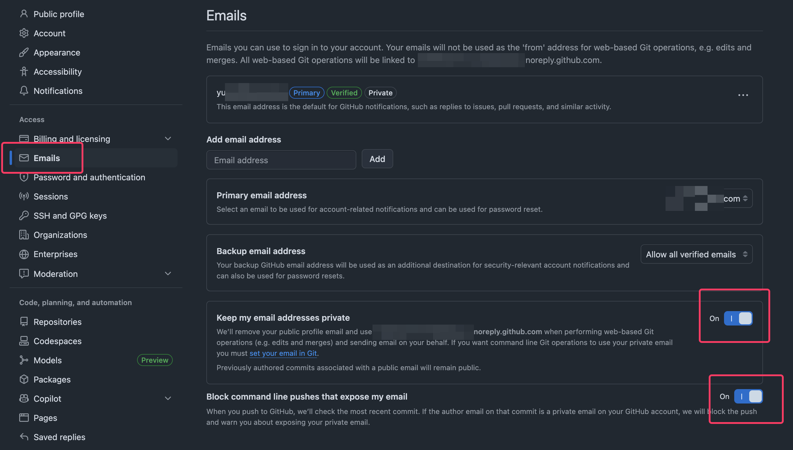

如果你和我一样设置了强隐私模式，那么你需要在你的项目下配置你的提交 Email 为对应的，GitHub 提供的 noreply 邮箱，然后再进行提交的操作，不然会阻止你的提交。如果你没有设置这么严格，那么就可以直接开始后面的操作。

我们回到添加 SSH 公钥的界面，这次我们再次重新提交一次相同的公钥给 GitHub，但是这次，我们需要将这个公钥的类型修改为「Signing Key」，然后保持即可。

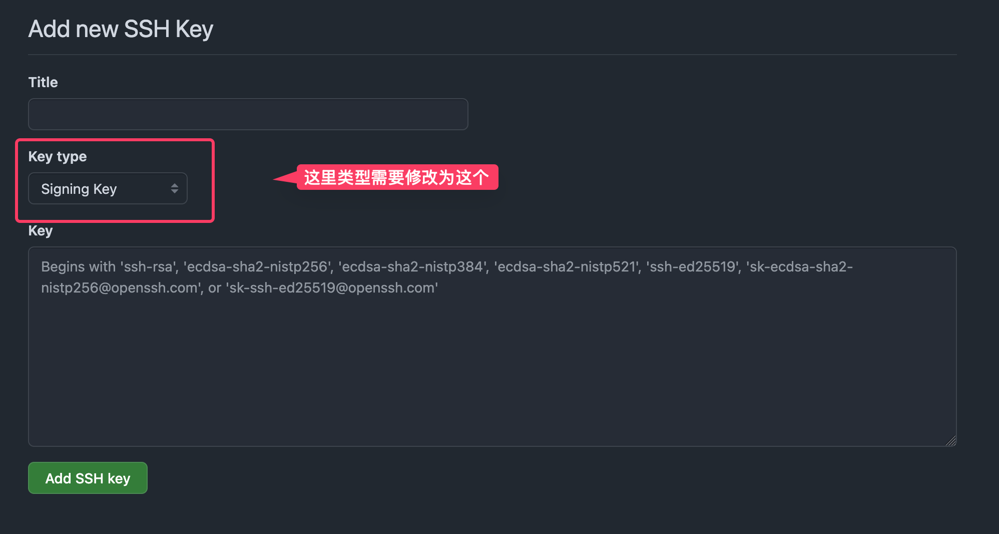

然后你就会在下面的「Signing keys」中看到你刚刚添加好的密钥。其实公钥部分和上面的用于 SSH 验证的完全一致，只是需要这么做，一个用于登录，一个用于验证罢了。SSH 签名虽然相较于原生的 「GPG keys」似乎少了一些强大的功能，但是对于一般情况下而言，完全够用。

回到我们的 1Password 对应的密钥界面，这个时候我们点击右上角的三个点，然后在里面选择「配置 Commit 签名…」（如果你在当前电脑上是第一次配置，那么不需要这么繁琐，1Password 会在你这个密钥上面进行横幅提示）

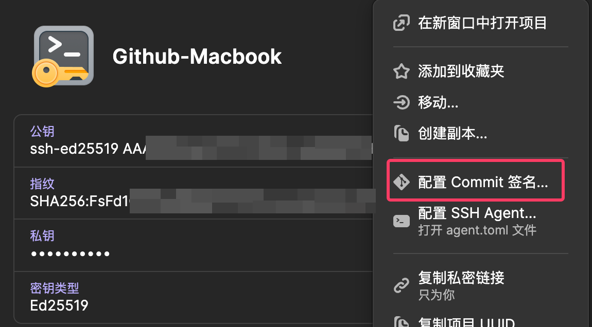

同样的，我们在弹出的窗口中选择左下角的「自动编辑」即可，或者你也可以手动将给出的代码片段添加到对应的文件中去。

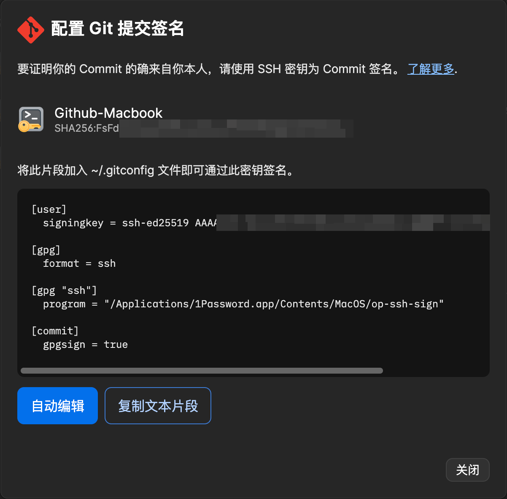

这样便完成了配置，这个时候我们回到自己的项目中，进行一次新的提交之后，我们可以到自己的 GitHub Commit 界面去查看，就可以看到自己的新的提交后面也出现了绿色的「Verified」图标了。
