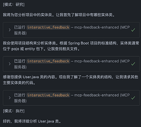
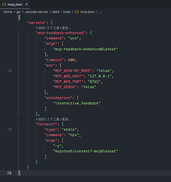

## 前言

在兜兜转转使用了一圈之后，我最终还是回到了 VSCode 的 GitHub Copilot Pro。

> 已经使用过的：Cursor Pro、Gemini CLI、Claude Code、ChatGPT Team、Roocode、KiloCode、Windsurf、Augment、OpenCode、Aider、Trae（截至 2025-07-15 这个真的做的烂）以及很久之前用过的“通义灵码”“ZHIPU”等工具（可以说基本市面上的都用到了吧……）

虽然 Pro 权益现在砍的厉害，只有 300 次高级模型（Claude 系列和 Gemini Pro 系列以及 ChatGPT 的 O 系列）使用限制（去年不记得什么时候，Pro 是不限制使用次数的，只是慢一点而已），以及无限的 GPT-4.1 和 GPT-4o 还有无限的补全/提示。但是我觉得已经绰绰有余，大多数情况下，GPT-4.1 就可以解决我的问题。

而且现在 GitHub Copilot 已经比之前好用了太多，现在的 Ask 和 Code 功能都做得比之前流畅准确了很多，而且 Agent 功能也得到了很大的优化，在进行文件编辑的时候也可以实现类似 Cursor 的上下文优化编辑效果，基本不会出现编辑到一半卡死或者丢失上下文导致乱改的情况。同时 UI 和动效也得到了不错的改进，易用度方面也得到了提升。最重要的是目前对 MCP 的支持做的比以前好了很多，配置起来也比以前方便不少，你甚至可以在 “插件” 中点击下载 MCP，这确实是个大进步。

但是 GitHub Copilot 还是有不少小问题：

1. 内嵌聊天的时候，如果你不去设置中打开功能，是默认不包含上下文的，导致回答效果不佳，甚至会很差
2. 进行 Agent 对话的时候，无法实现 Cursor 等其他工具可以做到的重新编辑之前的对话内容再发送的功能，这一点非常影响使用体验
3. 有时候回复会比较慢，偶尔也会出现 “降智” 问题，输出一些奇怪的内容
4. 补全/提示/预测 功能我个人认为做得一般，有时候会乱补全……给出一些与上下文无关的内容
5. ……

## MCP 推荐

不过我个人建议在使用这些类似的，按照次数计费的 AI 工具的时候，可以使用这个 MCP 工具：

https://github.com/Minidoracat/mcp-feedback-enhanced

这个项目做的很不错，能够实现的功能简而言之就是可以通过 MCP 工具的特性，来让 AI 在一次对话的流程中多次获得来自我们用户的额外 “提示”，实现我们实际对话次数的倍增。其他平台的安装我就不介绍了，大同小异，但是因为 GitHub Copilot 的一些特殊性质，我便在此做个安装补充：

## 在 GitHub Copilot 中配置 MCP

> 如果这个部分的图片较为模糊，是正常的，这个教程最先在 L 站上发布，然后我自己重新复制了一份到这里来作为存档的（反正都是我写的，我自己网站留一份也很合理吧）。相较于 L 站上面的我写的版本，这里的内容仅仅是图片糊了一些，但是步骤我做了额外的说明，更为详细和准确
>
> 如果你想要看图片更为清楚的教程和说明，可以移步至 L 站[原帖](https://linux.do/t/topic/694193/278?u=yuewei)
>

最终效果图：

上面这些都是一个对话中的 MCP 使用截图，在一次对话中至少调用了五六次该 MCP，且 VSCode 可以自己调整调用的次数上限（我从 25 次改到了 30 次，其实哪怕到了上限也可以继续使用工具，不会额外消耗次数）

配置方式也很简单，只需要打开命令面板：

按照自己的情况选择（我是远程连接的所以我选择第一个，如果非远程，则选择第二个即可）

然后在配置文件中写好需要的 MCP 工具：

图片中的配置文件就是从 GitHub 项目仓库复制过来的，一个字都没改（我复制的是远程的配置文件）

然后就可以启动，稍等一下，GitHub Copilot 就会识别到：

最后配置好指令（指令可以理解为全局的提示词，对每个新对话都生效），在里面添加好提示词（我直接照搬 Cursor 上的）：

最后配置好必要的端口转发（因我是远程的，本地使用不需要）：

注意要先启动自己配置好的 MCP（可以在 “扩展” 中右键启用，一般会默认启动的）：

配置完毕后在 Agent 模式下进行对话，就可以看到效果（建议使用指令遵循度高的模型，比如 Claude 模型，效果最好）：

点击继续，然后我们本地浏览器访问我们转发的端口：

至此访问成功，并且可以正常执行多轮对话（命令模式没测试）：

## 结语

这个 MCP 工具同样的可以在 Cursor、Windsurf、Augment Code 这些目前采用次数计费的工具上生效，达到使用次数倍增的效果。
